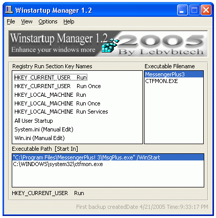



## Winstartup Manager 1\.2

### Description

This is the 3rd release of Winstartup Manager and it's (v 1.2). As the name says it manage all startup items in registry "Run" sections that usually executed when you reach your windows desktop. This version has been enhanced more to be user friendly as well as the registry key sections has been fixed from the image list to option boxes as well as added some nice features in the upper menus, check them yourself please and if its desire voting will be appriciated thank you .
 
### More Info
 

             |
---                |---
**Submitted On**   |2005-03-31 03:59:20
**By**             |[kegham](https://github.com/Planet-Source-Code/PSCIndex/blob/master/ByAuthor/kegham.md)
**Level**          |Intermediate
**User Rating**    |4.5 (18 globes from 4 users)
**Compatibility**  |VB 5\.0, VB 6\.0
**Category**       |[Windows System Services](https://github.com/Planet-Source-Code/PSCIndex/blob/master/ByCategory/windows-system-services__1-35.md)
**World**          |[Visual Basic](https://github.com/Planet-Source-Code/PSCIndex/blob/master/ByWorld/visual-basic.md)
**Archive File**   |[Winstartup1879614212005\.zip](https://github.com/Planet-Source-Code/kegham-winstartup-manager-1-2__1-60140/archive/master.zip)

